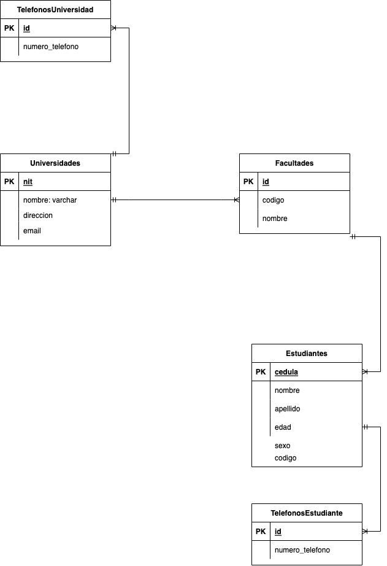
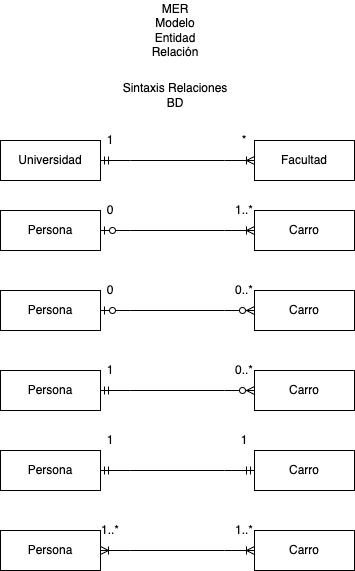
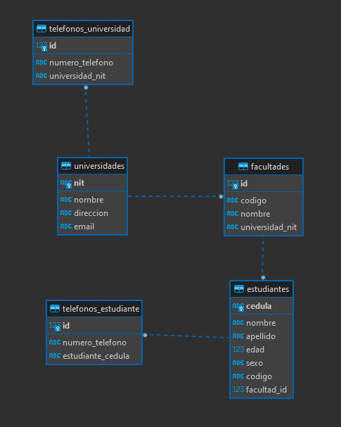

# Clase 27/07/22 - Notas Proyecto Universidad

# Proyecto Universidad
>El proyecto se hará en base a los siguientes diagramas:

### Diagrama de Clases


### Diagrama de Base de Datos


### Sintáxis Entidad-Relación



## Bases de Datos

> NOTA: CUando la E-R es de 1-m, la tabla que contiene m (muchos) tendrá la FK de la otra tabla

Para dar un ejemplo de como aplicar una FK miraremos lo siguiente:

``` sql
CREATE TABLE telefonos_universidad(
	id INTEGER PRIMARY KEY AUTOINCREMENT NOT NULL,
	numero_telefono VARCHAR(16),
  --Creación FK
	universidad_nit VARCHAR(10) NOT NULL,
	--Relacion con foreign key
	FOREIGN KEY(universidad_nit) REFERENCES universidades(nit)
);
```

Primero se crea la FK: `	universidad_nit VARCHAR(10) NOT NULL,`, por buenas prácticas una FK se nombra primero poniendo el nombre de la tabla a la que pertenece, seguido del nombre de la columna, es decir, `universidad_nit` toma el nombre de la tabla `universidad` y seguido separado por un `_` se le pasa el nombre de la PK de la tabla `universidad`.

* * *

>NOTA: Cuando a un campo se le asigna el tipo de dato `INTEGER` significa que se va a hacer algún tipo de operación matemática con él o que es una PK. Fuera de esos dos casos se debe usar `VARCHAR` ya que `INTEGER` consume más memoria que un `VARCCHAR`.

* * *

### Script SQL completo de la creación de las tablas

```sql
--CREAR TABLA UNIVERSIDAD
CREATE TABLE universidades(
	nit VARCHAR(10) PRIMARY KEY NOT NULL, 
	nombre VARCHAR(20) NOT NULL, 
	direccion VARCHAR(60) NOT NULL, 
	email VARCHAR(100) NOT NULL
);

--CREAR TABLA TELEFONOS-UNIVERSIDAD
CREATE TABLE telefonos_universidad(
	id INTEGER PRIMARY KEY AUTOINCREMENT NOT NULL,
	numero_telefono VARCHAR(16),
	universidad_nit VARCHAR(10) NOT NULL,
	--Relacion con foreign key
	FOREIGN KEY(universidad_nit) REFERENCES universidades(nit)
);

--TABLA FACULTADES
CREATE TABLE facultades(
	id INTEGER PRIMARY KEY AUTOINCREMENT NOT NULL,
	codigo VARCHAR(10) NOT NULL,
	nombre VARCHAR(60) NOT NULL,
	universidad_nit VARCHAR(10) NOT NULL,
	FOREIGN KEY(universidad_nit) REFERENCES universidades(nit)
);

--TABLA ESTUDIANTES
CREATE TABLE estudiantes(
	cedula VARCHAR(15) PRIMARY KEY NOT NULL,
	nombre VARCHAR(50) NOT NULL,
	apellido VARCHAR(50) NOT NULL,
	edad INTEGER(3) NOT NULL,
	sexo CHAR NOT NULL,
	codigo VARCHAR(20) NOT NULL,
	facultad_id INTEGER NOT NULL,
	FOREIGN KEY(facultad_id) REFERENCES facultades(id)
);

--TABLA TELEFONOS-ESTUDIANTES
CREATE TABLE telefonos_estudiante(
	id INTEGER PRIMARY KEY AUTOINCREMENT NOT NULL,
	numero_telefono VARCHAR(20) NOT NULL,
	estudiante_cedula VARCHAR(15) NOT NULL,
	FOREIGN KEY(estudiante_cedula) REFERENCES estudiantes(cedula)
);
```

### Diagrama E-R en DBeaver

Así quedaría el diagrama de Entidad-Relación dentro del gestor de DB DBeaver:


## Diagrama de Clases - Creación proyecto en JAVA.

Creamos un archivo `.java` para cada Clase que se encuentra en el diagrama.

### *Clase Persona*

***Creamos los atributos***:

```sql
private String nombre;
private String apellido;
private int edad;
private String cedula;
private char sexo;
private ArrayList<String> telefonos;
```

Ahora centremonos en el último atributo `private ArrayList<String> telefonos;`. Debido a que los arrays nativos de Java son de tamaño fijo no nos sirve para este ejemplo, ya que no sabemos el tamaño que tendrá el atributo `telefonos`, con lo cual debe ser un array dinámico. `ArrayList<>` cumple esa función, es un array de tipo dinámico el cual le podemos pasar n número de datos.

El `ArrayList` tiene algo que se llama función diamante, el cual son los signos `<>`, dentro de estos se pone el tipo de dato.

***Creamos el constructor***:

```sql
public Persona(String nombre, String apellido, int edad, String cedula, char sexo) {
    this.nombre = nombre;
    this.apellido = apellido;
    this.edad = edad;
    this.cedula = cedula;
    this.sexo = sexo;
    //inicializar telefonos
    this.telefonos = new ArrayList<String>();
}
```

En el constructor no le pasamos como parámetro el atributo `teléfonos` pero si lo vamos a inicializar: `    this.telefonos = new ArrayList<String>();`

***Creamos los consultores (SET)***:

Generamos consultores para todos los atributos.

```sql
public String getNombre() {
        return nombre;
    }
    public String getApellido() {
        return apellido;
    }
    public int getEdad() {
        return edad;
    }
    public String getCedula() {
        return cedula;
    }
    public char getSexo() {
        return sexo;
    }
    public ArrayList<String> getTelefonos() {
        return telefonos;
    }
```

***Creamos los modificadores (GET)***:

A diferencia de los consultores que los generamos todos, en los modificadores omitimos o no generamos el modificador para la `llamve primaria` (PK), que en este caso es el atributo `cedula`.

```sql
public void setNombre(String nombre) {
        this.nombre = nombre;
    }
    public void setApellido(String apellido) {
        this.apellido = apellido;
    }
    public void setEdad(int edad) {
        this.edad = edad;
    }
    public void setSexo(char sexo) {
        this.sexo = sexo;
    }
    public void setTelefonos(ArrayList<String> telefonos) {
        this.telefonos = telefonos;
    }
```

### *Clase Estudiante*
