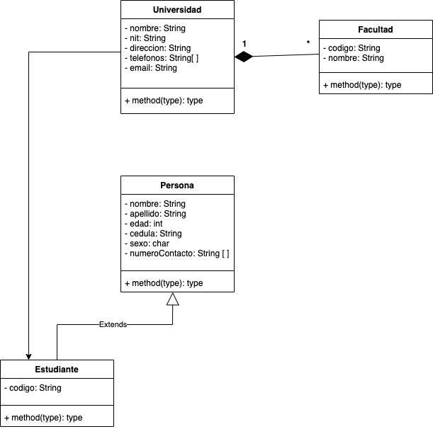
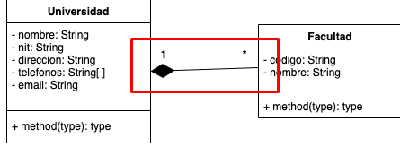

# Clase 27/07/22 - Notas Proyecto Universidad

# Proyecto Universidad
>El proyecto se hará en base a los siguientes diagramas:

### Diagrama de Clases



### Diagrama de Base de Datos


### Sintáxis Entidad-Relación


## Bases de Datos

> NOTA: CUando la E-R es de 1-m, la tabla que contiene m (muchos) tendrá la FK de la otra tabla

Para dar un ejemplo de como aplicar una FK miraremos lo siguiente:

``` sql
CREATE TABLE telefonos_universidad(
	id INTEGER PRIMARY KEY AUTOINCREMENT NOT NULL,
	numero_telefono VARCHAR(16),
  --Creación FK
	universidad_nit VARCHAR(10) NOT NULL,
	--Relacion con foreign key
	FOREIGN KEY(universidad_nit) REFERENCES universidades(nit)
);
```

Primero se crea la FK: `	universidad_nit VARCHAR(10) NOT NULL,`, por buenas prácticas una FK se nombra primero poniendo el nombre de la tabla a la que pertenece, seguido del nombre de la columna, es decir, `universidad_nit` toma el nombre de la tabla `universidad` y seguido separado por un `_` se le pasa el nombre de la PK de la tabla `universidad`.

* * *

>NOTA: Cuando a un campo se le asigna el tipo de dato `INTEGER` significa que se va a hacer algún tipo de operación matemática con él o que es una PK. Fuera de esos dos casos se debe usar `VARCHAR` ya que `INTEGER` consume más memoria que un `VARCCHAR`.

* * *

### Script SQL completo de la creación de las tablas

```sql
--CREAR TABLA UNIVERSIDAD
CREATE TABLE universidades(
	nit VARCHAR(10) PRIMARY KEY NOT NULL, 
	nombre VARCHAR(20) NOT NULL, 
	direccion VARCHAR(60) NOT NULL, 
	email VARCHAR(100) NOT NULL
);

--CREAR TABLA TELEFONOS-UNIVERSIDAD
CREATE TABLE telefonos_universidad(
	id INTEGER PRIMARY KEY AUTOINCREMENT NOT NULL,
	numero_telefono VARCHAR(16),
	universidad_nit VARCHAR(10) NOT NULL,
	--Relacion con foreign key
	FOREIGN KEY(universidad_nit) REFERENCES universidades(nit)
);

--TABLA FACULTADES
CREATE TABLE facultades(
	id INTEGER PRIMARY KEY AUTOINCREMENT NOT NULL,
	codigo VARCHAR(10) NOT NULL,
	nombre VARCHAR(60) NOT NULL,
	universidad_nit VARCHAR(10) NOT NULL,
	FOREIGN KEY(universidad_nit) REFERENCES universidades(nit)
);

--TABLA ESTUDIANTES
CREATE TABLE estudiantes(
	cedula VARCHAR(15) PRIMARY KEY NOT NULL,
	nombre VARCHAR(50) NOT NULL,
	apellido VARCHAR(50) NOT NULL,
	edad INTEGER(3) NOT NULL,
	sexo CHAR NOT NULL,
	codigo VARCHAR(20) NOT NULL,
	facultad_id INTEGER NOT NULL,
	FOREIGN KEY(facultad_id) REFERENCES facultades(id)
);

--TABLA TELEFONOS-ESTUDIANTES
CREATE TABLE telefonos_estudiante(
	id INTEGER PRIMARY KEY AUTOINCREMENT NOT NULL,
	numero_telefono VARCHAR(20) NOT NULL,
	estudiante_cedula VARCHAR(15) NOT NULL,
	FOREIGN KEY(estudiante_cedula) REFERENCES estudiantes(cedula)
);
```

### Diagrama E-R en DBeaver

Así quedaría el diagrama de Entidad-Relación dentro del gestor de DB DBeaver:


## Diagrama de Clases - Creación proyecto en JAVA.

Creamos un archivo `.java` para cada Clase que se encuentra en el diagrama.

### *Clase Persona*

***Creamos los atributos***:

```sql
private String nombre;
private String apellido;
private int edad;
private String cedula;
private char sexo;
private ArrayList<String> telefonos;
```

Ahora centremonos en el último atributo `private ArrayList<String> telefonos;`. Debido a que los arrays nativos de Java son de tamaño fijo no nos sirve para este ejemplo, ya que no sabemos el tamaño que tendrá el atributo `telefonos`, con lo cual debe ser un array dinámico. `ArrayList<>` cumple esa función, es un array de tipo dinámico el cual le podemos pasar n número de datos.

El `ArrayList` tiene algo que se llama función diamante, el cual son los signos `<>`, dentro de estos se pone el tipo de dato.

***Creamos el constructor***:

```sql
public Persona(String nombre, String apellido, int edad, String cedula, char sexo) {
    this.nombre = nombre;
    this.apellido = apellido;
    this.edad = edad;
    this.cedula = cedula;
    this.sexo = sexo;
    //inicializar telefonos
    this.telefonos = new ArrayList<String>();
}
```

En el constructor no le pasamos como parámetro el atributo `teléfonos` pero si lo vamos a inicializar: `    this.telefonos = new ArrayList<String>();`

***Creamos los consultores (SET)***:

Generamos consultores para todos los atributos.

```sql
public String getNombre() {
        return nombre;
    }
    public String getApellido() {
        return apellido;
    }
    public int getEdad() {
        return edad;
    }
    public String getCedula() {
        return cedula;
    }
    public char getSexo() {
        return sexo;
    }
    public ArrayList<String> getTelefonos() {
        return telefonos;
    }
```

***Creamos los modificadores (GET)***:

A diferencia de los consultores que los generamos todos, en los modificadores omitimos o no generamos el modificador para la `llamve primaria` (PK), que en este caso es el atributo `cedula`.

```sql
public void setNombre(String nombre) {
        this.nombre = nombre;
    }
    public void setApellido(String apellido) {
        this.apellido = apellido;
    }
    public void setEdad(int edad) {
        this.edad = edad;
    }
    public void setSexo(char sexo) {
        this.sexo = sexo;
    }
    public void setTelefonos(ArrayList<String> telefonos) {
        this.telefonos = telefonos;
    }
```

### *Clase Estudiante*
***Creamos los atributos***:

```java
private String codigo;
```

***Aplicando la herencia con clase Persona***

Tomando como referncia al diagrama de clases, la calse `Estudiante` hereda de la clase `Persona`, para aplicar la herencia tenemos que añadir `extends Persona`.

```java
public class Estudiante extends Persona{
    // --- ATRIBUTOS ---
    private String codigo;
}
```

***Generando el constructor***

Se pasarían todos los parámetro de la clase "Padre" (Persona) en el constructor y también se incluye el atributo propio de la clase `Estuuiante`

```java
public class Estudiante extends Persona{
    // --- ATRIBUTOS ---
    private String codigo;

    // --- CONSTRUCTOR ---
    public Estudiante(String nombre, String apellido, int edad, String cedula, char sexo, String codigo) {
    super(nombre, apellido, edad, cedula, sexo);
    this.codigo = codigo;
    }
}
```

***Generando consultor del attributo***

```java
    public String getCodigo() {
        return codigo;
    }
```

### *Clase Facultad*

El proceso es el mismo, se generan los atributos, el/los constructor/es, métodos get(consulto) y set(modificadores).

```java
public class Facultad {
    // --- ATRIBUTOS ---
    private String codigo;
    private String nombre;

    // --- CONSTRUCTORES ---

    public Facultad(String codigo, String nombre) {
        this.codigo = codigo;
        this.nombre = nombre;
    }

    // --- CONSULTORES ---
    public String getCodigo() {
        return codigo;
    }
    public String getNombre() {
        return nombre;
    }

    // --- MODIFICADORES ---
    public void setNombre(String nombre) {
        this.nombre = nombre;
    }
}
```

### *Clase Unviersidad*


***Creamos los atributos***

```java
public class Universidad {
    // --- ATRIBUTOS ---
    private String nombre;
    private String nit;
    private String direccion;
    private ArrayList<String> telefonos;
    private String email;
}
```
***Creamos el constructor***

No le pasamos como parámetro `telefono` al constructor, ya que `telefono` perteneces a un `ArrayList`

```java
public class Universidad {
    // --- ATRIBUTOS ---
    private String nombre;
    private String nit;
    private String direccion;
    private ArrayList<String> telefonos;
    private String email;
  
public Universidad(String nombre, String nit, String direccion, String email) {
        this.nombre = nombre;
        this.nit = nit;
        this.direccion = direccion;
        this.email = email;
        this.telefonos = new ArrayList<String>();
    }
}
```

***Creamos los consultores(get)***

```java
    // --- CONSULTORES ---
    public String getNombre() {
        return nombre;
    }
    public String getNit() {
        return nit;
    }
    public String getDireccion() {
        return direccion;
    }
    public ArrayList<String> getTelefonos() {
        return telefonos;
    }
    public String getEmail() {
        return email;
    }
    public ArrayList<Facultad> getFacultades() {
        return facultades;
    }
    public ArrayList<Estudiante> getEstudiantes() {
        return estudiantes;
    }
    public Map<String, ArrayList<String>> getMatriculas() {
        return matriculas;
    }
```

***Creamos los modificadores(set)***

En los modificadores no le pasamos el `nit` ya que es la PK(Primary Key)
```java
public void setNombre(String nombre) {
        this.nombre = nombre;
    }
    public void setDireccion(String direccion) {
        this.direccion = direccion;
    }
    public void setTelefonos(ArrayList<String> telefonos) {
        this.telefonos = telefonos;
    }
    public void setEmail(String email) {
        this.email = email;
    }
```

***Creando la relación 1-m entre Universidad y Facultad***



Para crear esa relación usaremos un Arreglo `ArrayList`, esa relación la pasamos como atributo dentro de la clase `Unviersidad`. Para establecer la relación usaremos el ArrayList con con función diamante `ArrayList<>`. También inicializamos la relación en el constructor `this.facultades = new ArrayList<Facultad>();`.

```java
public class Universidad {
    private String nombre;
    private String nit;
    private String direccion;
    private ArrayList<String> telefonos;
    private String email;
    //RELACION entre Universidad y facultades
    private ArrayList<Facultad> facultades;
  
    public Universidad(String nombre, String nit, String direccion, String email) {
        this.nombre = nombre;
        this.nit = nit;
        this.direccion = direccion;
        this.email = email;
        this.telefonos = new ArrayList<String>();
        //INICIALIZAR la relación
        this.facultades = new ArrayList<Facultad>();
}
```


MINUTO 1:47:03