# Bases de datos
Una base de datos es un conjunto de datos que nos provee de información para nuestras aplicaciones.

# Enfoques de archivos vs Enfoque bases de datos (DB No Relacional y DB relacional)
## Relacional
Estas están basadas en la formación de tablas y la relacion entre ellas.

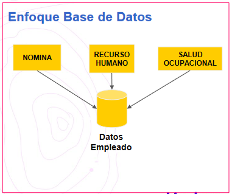

## No relacional
Están basadas en documentos

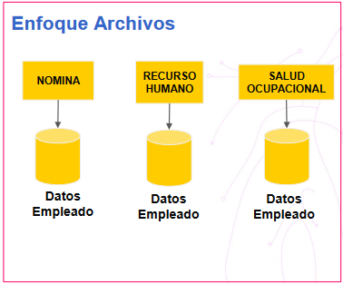

# Nomenclatura Boyce Codd
Relación entre tablas

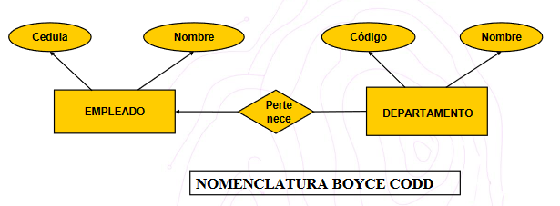

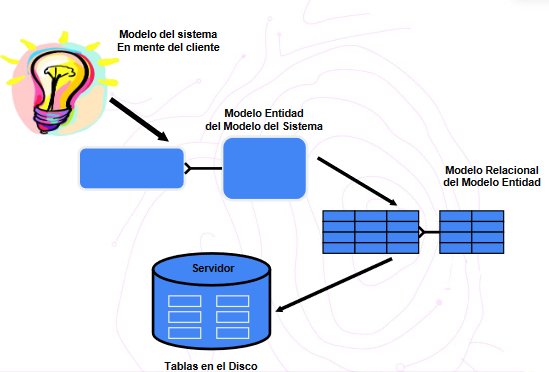

# Modelo de datos
Estructura lógica que adopta la base de datos incluyendo las relaciones y limitaciones que determinn cómo se almacenaan, organizan y cómo se accede a los datos.

## Tipos de modelo de base de datos

### Datos relacional
Es uno de los más comunes, se ordena mediante tablas que se relacionan entre si, compuests por columnas y filas

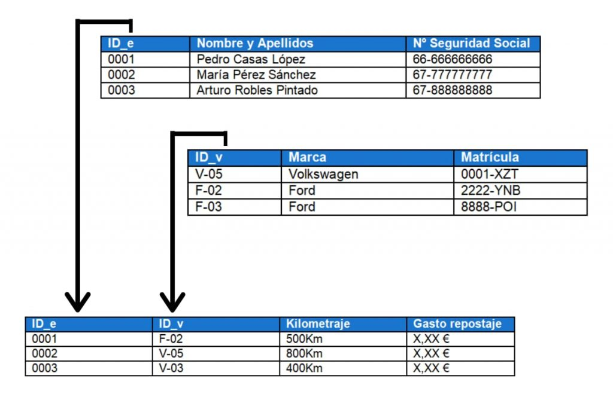

### Modelo jerárquico
Se caracteriza por presentar los datos en una estructura como un árbol, donde cada registro tiene su nodo raíz (nodo padre), del que surgen nuevos nodos (nodos hijos)

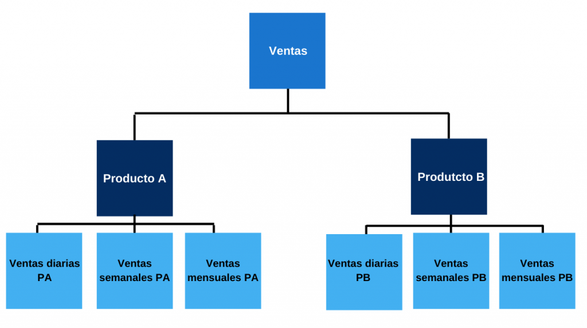

### Modelo de red
Este parte del modelo jerárquico, pero a diferencia del modelo jerárquico, en el modelo de red se permite las relaciones de uno a muchos o de muchos a muchos.

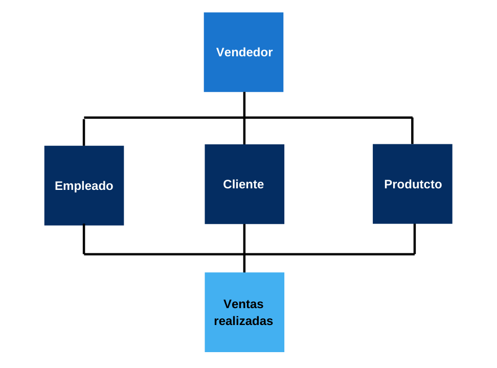

### Modelo orientado a objetos
Se define como una colección de objetos usados en POO, este modelo usa tablas (como el modelo relacional) pero no se limita a ellas, es decir, permite almacenar información detallada de cada objeto

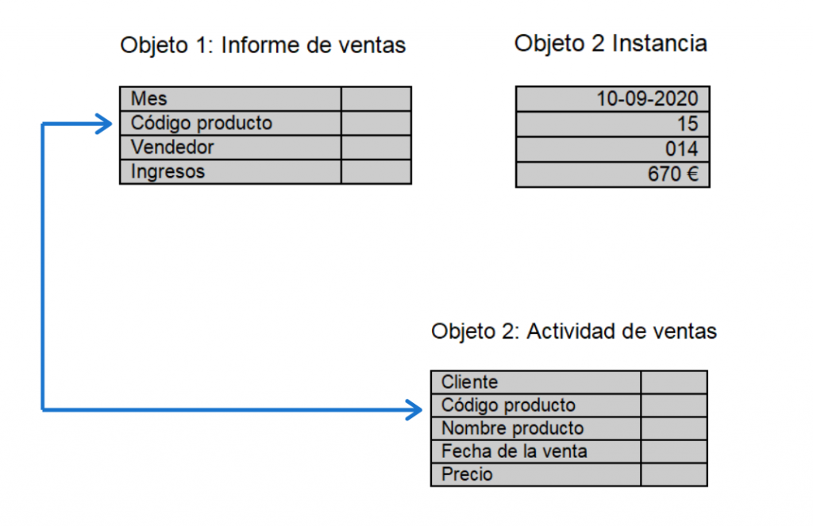

### Modelo relacional de objetos
Este modelo toma características del modelo relacional y el modelo orientado a objetos, de manera que funciona de manera similar al relacional, pero incorpora funciones del mdoelo orientado a objetos (Objetos, clases, herencia, polimorfisfo). Esto permite una mejor escalabilidad.

### Modelo entidad-relación
Permite representar las entidades relevantes de una DB así como sus integraciones y propiedades. Se representa mediante símbiolos definidos. Básicamente es el paso previo a un modelo de DB relacional ya que se trata de un diagrama elaborado con elementos básicos:

- Entidades: Objetos que representan en la DB
- Atributos: El contenido de la entidad u objeto, sus características.
- Relación: El vínculo que define la dependenci de un objeto y otro
- Cardinalidad: Como prticipan los objetos entre si (uno muchos, uno a uno, muchos a uno, muchos a muchos)

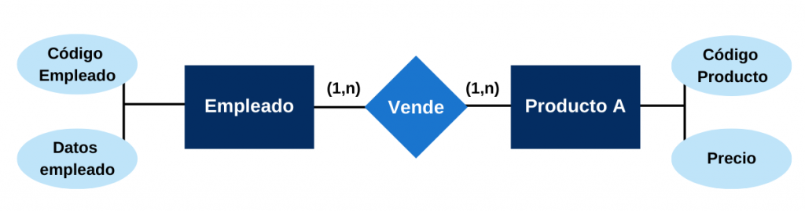

# Claves o llaves en las entidades
Las llaves son los identificadores únicos de cada registro, es decir, si se hace una compra, esa compra tiene su ID de venta para esa venta.

- Llaves primrias (PK): Representan al ID único de cada registro
- Llaves foráneas (FK): Representan las llaves primarias en otra tabla

  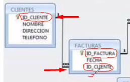
  
  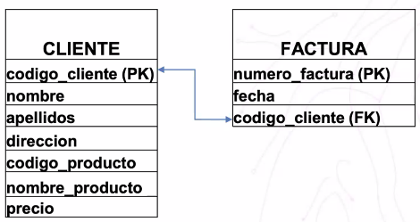
  
  ### Según la imagen
  - PK: Llave primaria
  - FK Llave foránea
  
# Normalizar
Serie de reglas par evitar consultas complejas. Está enfocado en eliminar redundancias en las tablas. En pocas palabras nos permite evitar la duplicidad de información.

- Evitar redundancia de datos
- Proteger integridad de datos
- Evitar problemas de actualizacion de datos

Tomemos como ejemplo una tabla cliente que almena algunos datos, entre ellos el número de ceulular del cliente...

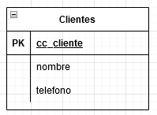

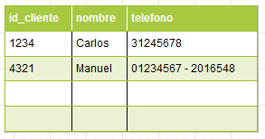

Todo está bien si sólo tiene 1 celular, ¿Pero qué pasa si tiene más de 1 celular? ¿Donde se registra esa información?, bueno... se podría poner los dos celulares separados por un guión:

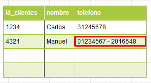

Pero eso serí muy mala práctica.
En esos casos cuando se pasa a normlizar una DB el campo teléfono se convierte en una nueva tabla:

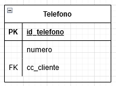

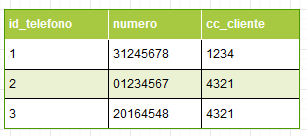

# Práctica con Bases de datos CONCEPTOS BÁSICOS
>NOTA: PARA EJECUTAR UNA INSTRUCCION EN SQL SIEMPRE SE DEBE TENER EL PUNTERO DE MOUSE AL FINAL DE LA SENTENCIA QUE SE QUIERA EJECUTAR, SE IDENTIFICA EL FINAL DE UNA SENTENCIA POR EL PUNTO Y COMA ( ; )

Usamos el gestor DBeaver con SQLite

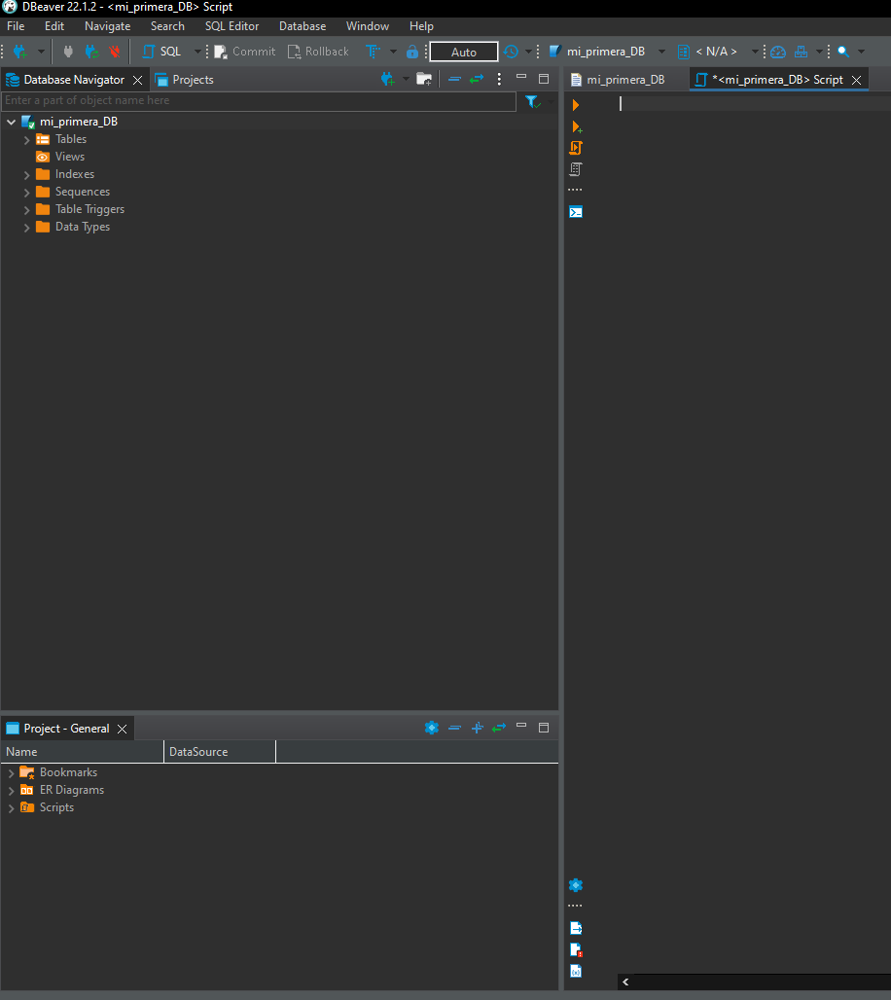

###Comentar una línea
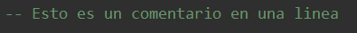

### Comentar varias líneas
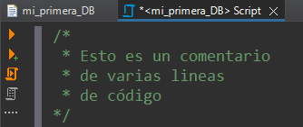

## Creación de tablas
Todo el contenido de la tabla se ingresa dentro de los paréntesis ()
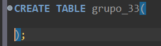

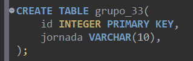

INTEGER: Representa los enteros
VARCHAR: Representa los strings

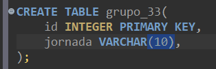

Se requiere poner un límite de caracteres que el usuario puede ingresar, esto con el fin de optimizar memoria y mejorar la seguridad. Se pone el número de caracteres a limitar dentro de un paréntesis() después del tipo de dato.

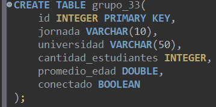

- id como llave primaria
- jornada de tipo varchar(String) con un límite de caracteres (10)
- universidad de tipo varchar con un límite de caracteres (50)
- promedio_edad de tipo double
- conectado de tipo booleano

Para crear la base de datos se va clic en "ejecutar"

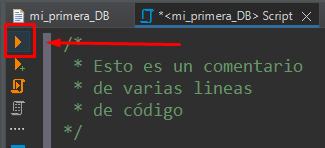

Una vez ejecutado se creará la tabla, la podemos ver en la parte lateral izquierda en "Tablas"

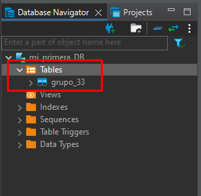

## Insertar datos dentro de la tabla
Primero "Llamamos" los campos a los cuales queremos pasarle un dato, para ello se usa INSERT INTO nombre_tabla(), después llenamos los campos con VALUES();

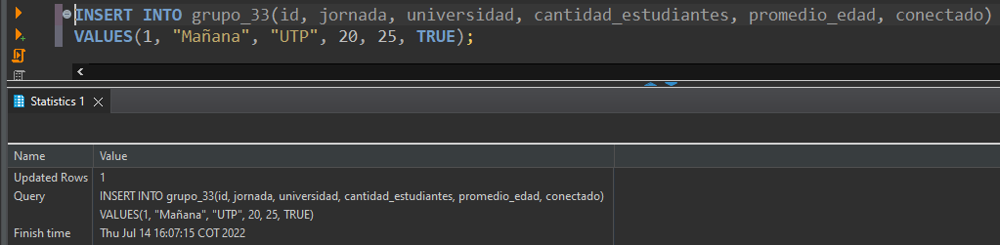

## Consultar los regisrtros

Selecciona todos los campos de la tabla grupo_33:

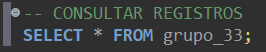

Al ejecutar nos muestra una tabla con los datos almacenados

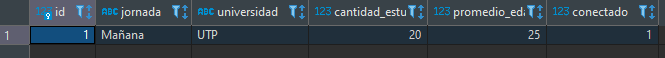

## Insertar valores con campos nulos
Aplicamos de nuevo el INSERT TO

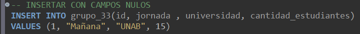

Y consultamos la tabla, veremos que los campos que no los indicamos en INSER TO aparecen como nulos

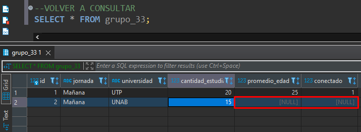

Lo recomendable es no tener esos campos nulos, ya que más adelante pueden ser un dolor de cabeza

## Eliminar una tabla

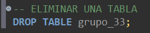

Al ejecutar la línea nos aparecerá un mensaje de advertencia, si estamos seguros de eliminarla le indicamos que "OK"

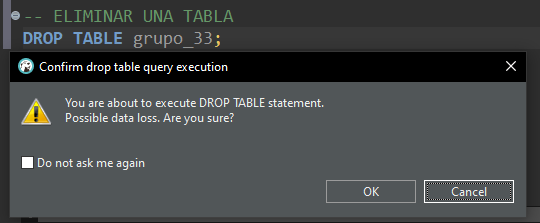

Para verificar que fue eliminada nos dirigimos al panel izquierdo, seleccionamos la tabla, clic derecho y por último "Refresh" para actualizar la base de datos.

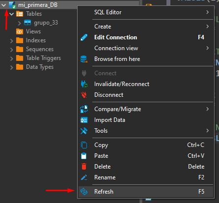

## Crear la misma tabla añadiendo NOT NULL a los campos

> NOT NULL: Obliga a que los campos no estén vacíos, obliga a rellenar.

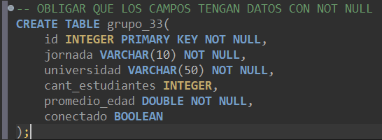

Ahora vamos a ver que pasa cuando no llenamos los campos que tienen NOT NULL

### Rellenando todos los campos:

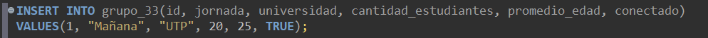

### Rellenando los campos con valores nulos

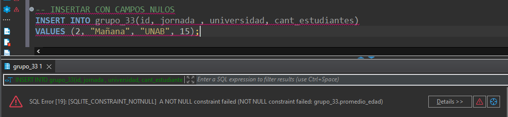

Nos salta el error de que ciertos campos no recibe valores nulos, por ende si o si tenemos que pasarle el valor al campo

Tendremos que insertar valores a los campos que no reciben valores nulos NOT NULL

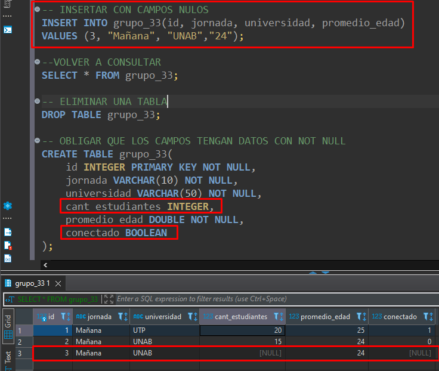

