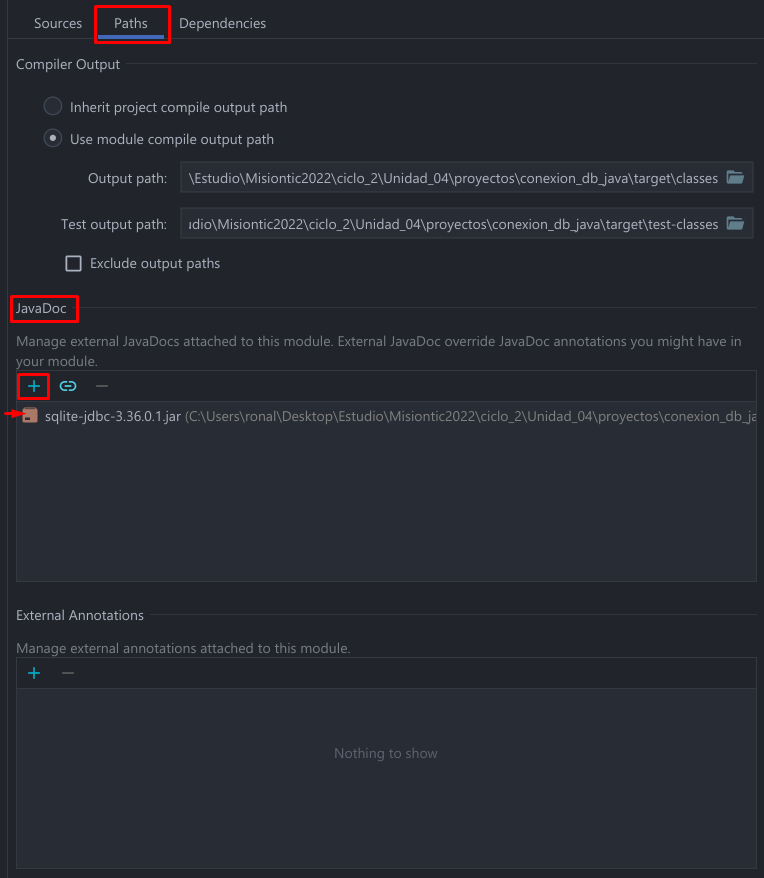
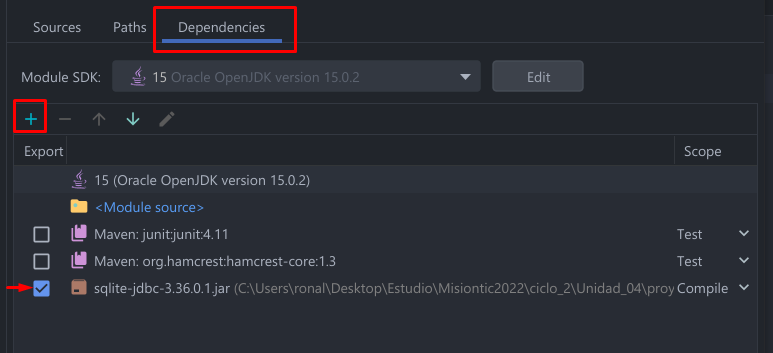

# Clase 25/07/22 - Unidad 4

# Conexión a DB sqlite
## Creación de la clase que establece la conexión a la DB
Se requiere un driver para establecer la conexión a la base de datos desde un lenguaje de programación. Cada base de datos tiene su propio driver, un driver para sqlite; un driver para mysql, etc..

Para establecer dicha conexión se crea un objeto `conn` el cual debemos pasarle algunos parámetros:

* url: indica la url de la ubicación de la base de datos
* user: indica el usuario (si es necesario)
* password: indica la contraseña (si es necesario)

La url debe tener su sintáxis requierida dependiendo de la base de datos que se esté usando (mysql, sqlite, etc...)

Para el ejemplo que usaremos sólo es necesario poner la `url` de la base de datos, ya que la trabajaremos localmente en el proyecto

``` java
Connection conn = DriverManager.getConnection(url)
```

Se usa el método `getConnection` pasándole la url para establecer la conexión a la base de datos. Si para el acceso de la base de datos se requiere de un usuario `user` y contraseña `password` se pone, de lo contrario no.

La conexión debe estar dentro de un manejador de errores `try{}catch(){}`

``` java
  String url = "jdbc:sqlite:hr.db";
  try{
    Connection conn = DriverManager.getConnection(url);
  }catch (Exception e){
    e.printStackTrace();
  }
```
Me presentó un error con el driver `No suitable driver found for jdbc:sqlite`. Para solucionarlo tuve que agregar el driver en las configuraciones del proyecto en IntelliJ Idea:

1.  **Primero se va a la siguiente configuración: File > Project Structure > Modules > Paths. Dentro de paths añadimos el Driver JDBC en JavaDoc.**
    

2.  **Vamos a la configuración: File > Project Structure > Modules > Dependencies: Dentro de dependencies añadimos el driver JDBC.**

> Podría interesar: https://www.youtube.com/watch?v=lRuTRWxU4z0

Ya solucionado el error, añadimos una condición para verificar que efectivamente se hizo la conexión.

`code`

``` java
try{
  Connection conn = DriverManager.getConnection(url);
  // Verificar que se establece la conexión
  if(conn != null){
    System.out.println("Conexión existosa");
  }
}catch (Exception e){
  e.printStackTrace();
}
```

`output`

``` java
Conexión existosa
```
Para poder hacer consultar a la base de datos se crea un objeto de tipo `Statement`, este objeto se crea dentro de la validación de la conexión.
``` java
Statement st = conn.createStatement();
```

Para ejecutar una consulta tenemos que crear un string con las instrucciones de las consultas a la base de datos

``` java
String query = "SELECT * FROM employees";
```

Seguido ejecutaremos las consultas a partir del objeto `Statement st` con `st.executeQuery()` y le pasamos la consulta en forma de `String query`
``` java
String query = "SELECT * FROM employees";
st.executeQuery(query);
```
Para capturar los resultados que retorna el executeQuery() usamos `Resultset`. Ese resultado sería como la forma gráfica en forma de "tabla" que muestra los datos, así como se ve en el DBeaver.

``` java
String query = "SELECT * FROM employees";
ResultSet result_1 = st.executeQuery(query);
```
Ahora para imprimir los resultados en la consula tendremos que iterar la captura del retorno de los resultados, usaremos un while con el `.next()`. `.next()` recorre o avanza en los datos, hasta que no hayan más datos por iterar. Mientras existan registros por iterar, se van a obtener.

> AVERIGUAR MÁS SOBRE .next()

``` java
while (result_1.next()){}
```

Para acceder a esos datos iterados.
``` java
String nombre = result_1.getString("first_name");
```
Obtenemos los datos de tipo String que están en la columna llamada "first_name". Por último imprimimos los datos de `nombre`.
``` java
System.out.println("Nombre: " + nombre);
```

### Código completo:
``` java
import java.sql.Connection;
import java.sql.DriverManager;
import java.sql.ResultSet;
import java.sql.Statement;

public class App
{
    public static void main( String[] args ) {
        conectarDB();
    }

    public static void conectarDB(){
        String url = "jdbc:sqlite:hr.db";
        try{
            //Crear conexión
            Connection conn = DriverManager.getConnection(url);
            //Validar conexión
            if(conn != null){
                System.out.println("Conexión existosa");
                //Crear objeto para ejecutar consultas sql
                Statement st = conn.createStatement();
                //Ejecutar consulta
                String query = "SELECT * FROM employees";
                ResultSet result_1 = st.executeQuery(query); //Retorna el resultado de la consulta `query`
                //Iterar result_t
                while (result_1.next()){
                    //Acceder a los valores de la columnas
                    String nombre = result_1.getString("first_name");
                    System.out.println("Nombre: " + nombre);
                }

            }
        }catch (Exception e){
            e.printStackTrace();
        }
    }
}
```

### Output
``` java
Conexión existosa
Nombre: Steven
Nombre: Neena
Nombre: Lex
Nombre: Alexander
Nombre: Bruce
Nombre: David
Nombre: Valli
Nombre: Diana
Nombre: Nancy
Nombre: Daniel
Nombre: John
Nombre: Ismael
Nombre: Jose Manuel
Nombre: Luis
Nombre: Den
Nombre: Alexander
Nombre: Shelli
Nombre: Sigal
Nombre: Guy
Nombre: Karen
Nombre: Matthew
Nombre: Adam
Nombre: Payam
Nombre: Shanta
Nombre: Irene
Nombre: John
Nombre: Karen
Nombre: Jonathon
Nombre: Jack
Nombre: Kimberely
Nombre: Charles
Nombre: Sarah
Nombre: Britney
Nombre: Jennifer
Nombre: Michael
Nombre: Pat
Nombre: Susan
Nombre: Hermann
Nombre: Shelley
Nombre: William

Process finished with exit code 0

```

>Link del proyecto: https://github.com/comayocode/Misiontic/tree/master/ciclo_2/Unidad_04/proyectos/conexion_db_java