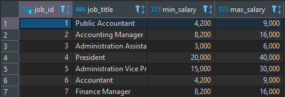

# Clase 26/07/22 - Unidad 4

## Resumen clase anterior
1. Tener el driver correspondiente para conectar la db
2. Crear un objeto para la conexión
``` java
Connection conn = DriverManager.getConnection(url);
```
3. Generar objetos de consulta a partir del objeto de conexión como:
   - `Statement`: Se usa cuando ya se tienen las consultas definidas y los valores de esas consultas no van a cambiar
   - `PreparedStatement`: Se usa cuando ya se tiene la estructura de la consulta pero los valores van a cambiar, ejemplo: Cuando se usa `WHERE`  - `SELECT * FROM employees WHERE ID = miVariable`, al ser una variable su valor va a cambiar.
4. Ejecutamos una consulta guardandola en un String:
``` java
String query = "SELECT * FROM employees";
```
5. Creamos un ResultSet el cual retorna la "tabla" que se muestra en DBeaver
``` java
ResultSet result_1 = st.executeQuery(query);
```
6. Capturar los valores de `ResultSet` iterandolo.
``` java
while (result_1.next()){
    String nombre = result_1.getString("first_name");
    String apellido = result_1.getString("last_name");
    info += "Nombre: " + nombre;
    info += "\nApellido: " + apellido;
    info += "\n----------------\n";
}
```

### Trabajando con PreparedStatement

Para que se vea un poco más legible el código se creará un método para cada consulta.

## Seleccionar todos los empleados (método selectAllEmployees())

Creamos el método statico y le pasamos que reciba como parámetro un Statement. La consulta requiere de un manejador de exeption, pero `try{}catch(){}` no lo pondemos poner para un método, para ello usaremos como reemplazo `throws Exception`:  `public static void selectAllEmployees(Statement st) throws Exception{}`.

``` java
public static void selectAllEmployees(Statement st) throws Exception{
    //Ejecutar consulta
    String query = "SELECT * FROM employees";
    ResultSet result_1 = st.executeQuery(query); //Retorna el resultado de la consulta `query`
    String info = "";
    //Iterar result_t
    while (result_1.next()){
        //Acceder a los valores de la columnas
        String nombre = result_1.getString("first_name");
        String apellido = result_1.getString("last_name");
        info += "Nombre: " + nombre;
        info += "\nApellido: " + apellido;
        info += "\n----------------\n";
    }
    System.out.println(info);
}
```

## Realizar insert sobre Jobs (método insertJobs())

Creamos el método que reciba como parámetro el objeto `Connection conn` y que no falte el manejador de exeptions `throws SQLException`: `public static void insertJob(Connection connn) throws SQLException{}`.

Debido a vamos a insertar valores, van a variar dichos valores, por ende se usará el `PreparedStatement`. 

### Crear valores a insertar en la tabla

Creamos o asignamos los valores que vamos a insertar en `jobs`. En la tabla `jobs` de la DB hay 4 columnas, debido a que el `ID` es Autoincrementable no hay necesidad de insertarlo, con lo cual sólo son 3 campos a insertar, `job_title` `min_salary` y `max_salary`.


``` java
String job_title = "Developer";
int min_salary = 2000;
int max_salary = 15000;
```

### Preparar la consulta

Preparamos o creamos la consulta del PreparedStatement para poder insertar los datos en la columnas correspondientes.

``` java
PreparedStatement pst = connn.prepareStatement("INSERT INTO jobs(job_title, min_salary, max_salary) VALUES(?, ?, ?)");
```

- `INSERT INTO jobs(job_title, min_salary, max_salary)`: Indicamos las columnas en las que queremos asignar los valores
- `VALUES(?, ?, ?)`: Indicamos los valores con signos de interrogación ( ? ) como son 3 columnas le indicamos 3 signos de interrogación ( ? ). Cada signos de interrogación representan los valores para cada columna.

### Setear o establecer los valores la consulta

Se le aplica un `set` pasandole el tipo de dato que tiene la columna, seguido se le indica la posición de columna, aquí empezamos desde la posición 1 ya que el índice es la posición 0, pero no le estamos insertando valores al ID.

``` java
pst.setString(1, job_title);
pst.setInt(2, min_salary);
pst.setInt(3, max_salary);
```

>Por el momento sólo se ha preparado la consulta, no se ha ejecutado

### Ejecutar consulta


``` java
pst.executeUpdate();
```

>Se usa executeUpdate() cuando se cambian los valores de la tabla (INSERT y DELETE).
>Se usa excecuteQuery() cuando se espera una respuesta de datos (SELECT).
 
``` java
public static void insertJob(Connection connn) throws SQLException{
    //Creamos o asignamos los nuevos datos a insertar dentro de jobs (insertar un nuevo puesto con su rango de salario)
    String job_title = "Developer";
    int min_salary = 2000;
    int max_salary = 15000;
    //Preparar consulta SQL
    PreparedStatement pst = connn.prepareStatement("INSERT INTO jobs(job_title, min_salary, max_salary) VALUES(?, ?, ?)");
    //Setear valores de consulta
    pst.setString(1, job_title);
    pst.setInt(2, min_salary);
    pst.setInt(3, max_salary);
    //Ejecutar la consulta
    pst.executeUpdate();
}
```

## Seleccionar todos los trabajos (método selectAllJobs())

Ahora creamos el método para seleccionar los trabajos. Statico, pasando como parámetro el `Statement` (Se usa Statement ya que no se van a cambiar/actualizar los valores), y por último el manejador de exeptions `throws SQLException`: `public static void selectAllJobs(Statement st) throws SQLException {}`.

Generamos la consulta
```java
ResultSet result = st.executeQuery("SELECT * FROM jobs");
```

Iteramos los valores de ResultSet
```java
while (result.next()){
        System.out.println("Jobs: " + result.getString("job_title"));
    }
```

>Es la misma dinámica que el primer método (selectAllEmployees())

```java
public static void selectAllJobs(Statement st) throws SQLException {
    ResultSet result = st.executeQuery("SELECT * FROM jobs");
    while (result.next()){
        System.out.println("Jobs: " + result.getString("job_title"));
    }
}
```

## Llamar los métodos dentro del método conectarDB()

Llamamos los métodos insertJob(conn); y selectAllJobs(st); dentro del if.

```java
public static void conectarDB(){
    String url = "jdbc:sqlite:hr.db";
    try{
        //Crear conexión
        Connection conn = DriverManager.getConnection(url);
        //Validar conexión
        if(conn != null){
            System.out.println("Conexión existosa");
            //Crear objeto para ejecutar consultas sql
            Statement st = conn.createStatement();
            insertJob(conn);
            selectAllJobs(st);
        }
    }catch (Exception e){
        e.printStackTrace();
    }
```

* * *
### Código completo

```java
import java.sql.*;

public class App {
    public static void main( String[] args ) {
        conectarDB();
    }

    public static void conectarDB(){
        String url = "jdbc:sqlite:hr.db";
        try{
            //Crear conexión
            Connection conn = DriverManager.getConnection(url);
            //Validar conexión
            if(conn != null){
                System.out.println("Conexión existosa");
                //Crear objeto para ejecutar consultas sql
                Statement st = conn.createStatement();
                insertJob(conn);
                selectAllJobs(st);
            }
        }catch (Exception e){
            e.printStackTrace();
        }
    }

    public static void selectAllEmployees(Statement st) throws Exception{
        //Ejecutar consulta
        String query = "SELECT * FROM employees";
        ResultSet result_1 = st.executeQuery(query); //Retorna el resultado de la consulta `query`
        String info = "";
        //Iterar result_t
        while (result_1.next()){
            //Acceder a los valores de la columnas
            String nombre = result_1.getString("first_name");
            String apellido = result_1.getString("last_name");
            info += "Nombre: " + nombre;
            info += "\nApellido: " + apellido;
            info += "\n----------------\n";
        }
        System.out.println(info);
    }

    public static void insertJob(Connection connn) throws SQLException{
        String job_title = "Developer";
        int min_salary = 2000;
        int max_salary = 15000;
        //Preparar consulta SQL
        PreparedStatement pst = connn.prepareStatement("INSERT INTO jobs(job_title, min_salary, max_salary) VALUES(?, ?, ?)");
        //Setear valores de consulta
        pst.setString(1, job_title);
        pst.setInt(2, min_salary);
        pst.setInt(3, max_salary);
        //Ejecutar la consulta
        pst.executeUpdate();
    }

    public static void selectAllJobs(Statement st) throws SQLException {
        ResultSet result = st.executeQuery("SELECT * FROM jobs");
        while (result.next()){
            System.out.println("Jobs: " + result.getString("job_title"));
        }
    }
}
```

### Output antes de insertar nuevo trabajo

```java
Conexión existosa
Jobs: Public Accountant
Jobs: Accounting Manager
Jobs: Administration Assistant
Jobs: President
Jobs: Administration Vice President
Jobs: Accountant
Jobs: Finance Manager
Jobs: Human Resources Representative
Jobs: Programmer
Jobs: Marketing Manager
Jobs: Marketing Representative
Jobs: Public Relations Representative
Jobs: Purchasing Clerk
Jobs: Purchasing Manager
Jobs: Sales Manager
Jobs: Sales Representative
Jobs: Shipping Clerk
Jobs: Stock Clerk
Jobs: Stock Manager

Process finished with exit code 0

```

### Output al insertar nuevo trabajo
```java
Conexión existosa
Jobs: Public Accountant
Jobs: Accounting Manager
Jobs: Administration Assistant
Jobs: President
Jobs: Administration Vice President
Jobs: Accountant
Jobs: Finance Manager
Jobs: Human Resources Representative
Jobs: Programmer
Jobs: Marketing Manager
Jobs: Marketing Representative
Jobs: Public Relations Representative
Jobs: Purchasing Clerk
Jobs: Purchasing Manager
Jobs: Sales Manager
Jobs: Sales Representative
Jobs: Shipping Clerk
Jobs: Stock Clerk
Jobs: Stock Manager
Jobs: Developer

Process finished with exit code 0
```